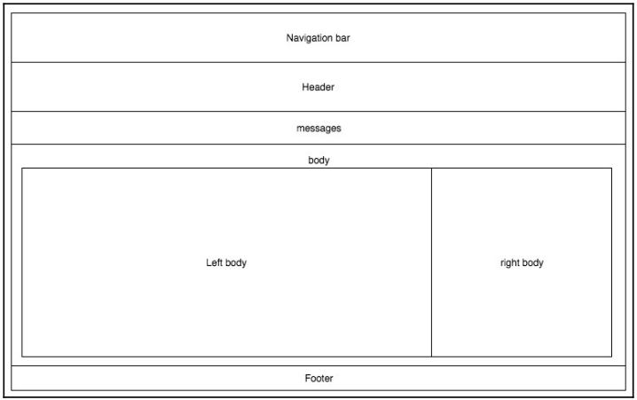

# <center>用模板创建视图
我们可以轻松获取到了数据后，在网页上展示信息就变得更简单啦。本章，我们会学习如下内容：
* 使用Flask自带的Jinja模板语言为SQLAlchemy模型动态创建HTML
* 使用Jinja方法自动创建HTML，并修改模板内部的数据表示
* 用Jinja自动创建并校验HTML表达

---------------------------------

# Jinja语法
Jinja是Python写得模板语言。模板语言用于自动创建文档。在某些模板语言中，传递到模板的变量会替换模板中预定义的元素。在Jinja中，通过定义 {{ }} 来进行变量替换。{{ }} 语法叫做变量块儿。也有由  定义的控制块儿，它会声明语言函数，如 *loop* 或 *if* 声明。比如，可以将当第二章的 *Post* 模型传递给它：
```html
<h1>{{ post.title }}</h1>
```
效果如下：
```html
<h1>First Post</h1>
```
Jinja模板中所展示的变量可以是任意的Python类型或对象，只要能通过Python的str()函数转换成字符串就行。比如，传递给模板的字典或列表可以通过下述代码展示它的属性：
```jinja
{{ your_dict['key'] }}
{{ your_list[0] }}
```
一些程序员喜欢使用JavaScript来做模板功能，动态创建HTML文档来渲染加载自服务器的HTML。本章不会涉及此功能，因为这是高级的JavaScript话题。然而，一些JavaScript模板引擎也用 {{ }} 语法。如果我们选择将Jinja与JavaScript模板结合定义在HTML文件中，那么可以把JavaScript模板放到 *raw* 控制块儿中告诉Jinja忽略这部分代码：
```html

<script id="template" type="text/x-handlebars-template">
    <h1>{{title}}</h1>
    <div class="body">
        {{body}}
    </div>
</script>

```

## 过滤器
虽然Jinja和Python较为相似，但它们的语法是不一样的。二者由很多差别。
我们会在这部分看到，并没有Python函数出现。相反，在Jinja中，变量可以传递至修改变量的内建函数用于展示。这些函数就叫作过滤器，在变量块中用管道符调用：
```jinja
{{ variable | filter_name(*args) }}
```

此外，如果没有向过滤器传递任何参数，可以省略掉括号：
```jinja
{{ variable | filter_name }}
```

控制块的过滤器也适用于文本块儿：
```jinja

    A bunch of text

```

Jinja中有很多的过滤器；本书仅涵盖最常用的那些。为了简洁，在每个示例中，每个过滤器的输出都会直接在过滤器之下列出来。
```
Jinja所有默认的过滤器列表可以访问：
http://jinja.pocoo.org/docs/dev/templates/#list-of-builtin-filters
```

### 默认过滤器
如果传递的变量是 *None* ，可以用 *default* 值进行替换：
```jinja
{{ post.date | default('2015-01-01') }}
2015-01-01
```

### 转义过滤器
如果传递的变量是HTML变量，那么 &, <, >, ', 和 " 会被作为HTML转义字符输出：
```jinja
{{ "<h1>Title</h1>" | escape }}
<h1>Title</h1>
```

### 浮点过滤器
浮点转换器使用Python的 *float()* 函数将传递的值转换为浮点数：
```jinja
{{ 75 | float }}
75.0
```

### 整数过滤器
浮点转换器使用Python的 *int()* 函数将传递的值转换为整数：
```jinja
{{ 75.7 | int }}
75
```

### join过滤器
The join filter joins elements of a list with a string, and works in exactly the same way as
the list method of the same name. It is given as follows:
```jinja
{{ ['Python', 'SQLAlchemy'] | join(',') }}
Python, SQLAlchemy
```

### length filter
The length filter fills the same role as the Python len() function. It is used as follows:
```jinja
Tag Count: {{ post.tags | length }}
Tag Count: 2
```

### round过滤器
round过滤器将浮点数按指定精度进行转换：
```jinja
{{ 3.141592653589793238462 | round(1) }}
3.1
```
我们也可以指定数字转换的形式：
```jinja
{{ 4.7 | round(1, "common") }}
5
{{ 4.2 | round(1, "common") }}
4
{{ 4.7 | round(1, "floor") }}
4
{{ 4.2 | round(1, "ceil") }}
5
```

*common* 选项对数字做四舍五入的操作。*floor* 选项总会向下转换，*ceil* 不看小数值，直接进一。

### safe过滤器
如果我们尝试从变量将HTML插入页面，当我们向展示博文时，Jinja会自动尝试向输出增加HTML转义符：
```jinja
{{ "<h1>Post Title</h1>" }}
<h1>Post Title</h1>
```

这是一个必要的安全功能，当应用的输入可以让用户提交任意文本，就会产生漏洞，恶意用户可以用输入HTML代码。比如，如果用户要提交一个script标签作评论，Jinja没有这个功能的话，脚本会在所有访问了次页面的浏览器上执行。

然而，我们仍需要一种展示我们已知是安全的HTML的方式，如我们的博文HTML。
我们可以使用 *safe* 过滤器实现：
```jinja
{{ "<h1>Post Title</h1>" | safe }}
<h1>Post Title</h1>
```

### title过滤器
The title filter enables us to capitalize a string using the title case format as follows:
```jinja
{{ "post title" | title }}
Post Title
```

### tojson过滤器
我们使用此过滤器将变量传递给Python的json.dumps函数，如下所示。要记得我们传递的对象必须得是可被 *json* 模块序列化的：
```jinja
{{ {'key': False, 'key2': None, 'key3': 45} | tojson }}
{key: false, key2: null, key3: 45}
```

这个功能常用作基于页面加载而非AJAX请求，向JavaScript MVC框架传递SQLAlchemy模型。如果用这种方式使用 tojson 的话，记得将结果传递到 safe 过滤器，并确保JavaScript中没有HTML转义符。这里有一个用流行JavaScript MVC框架 * Backbone.js* 获取模型集合的示例：
```javascript
var collection = new PostCollection({{ posts | tojson | safe }});
```

### truncate过滤器
truncate过滤器接收一个长字符串，返回一个固定长度的截断的字符串，尾部为省略号：
```jinja
{{ "A Longer Post Body Than We Want" | truncate(10) }}
A Longer...
```

默认情况下，字符传会对半截断。传递 True 作额外参数可以禁用此功能。
```jinja
{{ "A Longer Post Body Than We Want" | truncate(10, True) }}
A Longer P...
```

### 自定义过滤器
向Jinja增加自定义过滤器就像写Python函数一样。
为了理解自定义过滤器，我们看一个示例。这个简单的过滤器会在字符串中计算子串的数量：
```jinja
{{ variable | count_substring("string") }}
```

我们需要用如下签名写一个新的Python函数：
```python
def count_substring(variable, sub_string)
```

过滤器的定义如下：
```python
@app.template_filter
def count_substring(string, sub_string): 
    return string.count(sub_string)
```

我们得将它进行注册，将它加到 *main.py* 文件中 *jinja_env* 对象的 *filters* 字典中。我们可以使用 *@app.template_filter* 装饰器来处理这个过程。

## 注释
通过 *{# #}* 定义模板中的注释。Jinja会忽略这段代码，不会在返回的HTML代码中出现：
```jinja
{# Note to the maintainers of this code #}
```

## 使用if声明
Jinja中的 *if* 声明与Python中的类似。
返回值的布尔值决定了代码流向：
```jinja

    <a href='/logout'>Logout</a>

    <a href='/login'>Login</a>

```

过滤器也可以用在 *if* 声明中：
```jinja

    There are {{ comments | length }} comments

    There are no comments

```

## 循环
我们可以在Jinja中使用循环来迭代列表或生成器函数：
```jinja

    <div>
        <h1>{{ post.title }}</h1>
        <p>{{ post.text | safe }}</p>
    </div>

```

可以将循环与 *if* 声明结合使用来模仿Python循环的 *break* 功能。下述示例中， 循环只会迭代 *post.text* 不是 *None* 的博文：
```jinja

 <div>
 <h1>{{ post.title }}</h1>
 <p>{{ post.text | safe }}</p>
 </div>

```

我们可以在循环内访问 *loop* 这个特殊变量，它给予了我们 for 循环的信息。
如果我们想像Python的 *enumerate* 函数一样，知道当前循环的索引，我们可以用 *loop* 变量的索引变量：
```jinja

    {{ loop.index }}. {{ post.title }}

```
输出结果如下：
```
1. Post Title
2. Second Post
```

## 宏
宏可以看作是Jinja中的函数，它可以返回模板或HTML字符串。
用于避免重复代码的编写，并将其缩减成为函数来调用。
比如，下述的宏用于添加Bootstrap CSS输入和标签至我们的模板中：
```jinja

    <div class="form-group">
        <label for"{{ name }}">{{ label }}</label>
        <input type="{{ type }}" name="{{ name }}" value="{{ value | escape }}" class="form-control">
    </div>

```

向任意模板的表格中快速添加输入，这样调用我们的宏：
```jinja
{{ input('name', 'Name') }}
```

会得到下述输出：
```html
<div class="form-group">
    <label for"name">Name</label>
    <input type="text" name="name" value="" class="form-control">
</div>
```

## Flask特定的变量与函数
Flask让我们可以在模板中访问一些特定函数和对象变量。

### config对象
Flask可以使得在模板中获取 *config* 对象：
```jinja
{{ config.SQLALCHEMY_DATABASE_URI }}
sqlite:///database.db
```

### request对象
Flask *request* 对象指向当前请求：
```jinja
{{ request.url }}
http://127.0.0.1/
```

### session对象
Flask *session* 对象如下：
```jinja
{{ session.new }}
True
```

### url_for()函数
通过传递路由函数名作参数，*url_for* 函数返回一个路由的URL。
这可以让我们不用担心因为URLs变化而导致链接被破坏：
```jinja
{{ url_for('home') }}
/
```

这里，*home* 是注册在Flask终端上的函数名字，相关的URL根与其相关联，因此，在我们的 *main.py* 文件上，我们必须得定义一个函数来处理HTTP请求，并使用 *app.route(rule, \*\*options)* 将其注册到Flask上：
```python
@app.route('/')
def home():
...
```

如果路由的URL中有位置参数，我们将这些参数作为关键字参数传递。这些参数会进行填充并生成URL：
```jinja
{{ url_for('post', post_id=1) }}
/post/1
```

用于处理此请求的对应函数，我们限制此方法仅处理GET和POST HTTP请求：
```python
@app.route('/post/<int:post_id>', methods=('GET', 'POST'))
def post(post_id):
...
```

### get_flashed_messages()函数
*get_flashed_messages()* 函数返回了一个存有所有经过Flask中 *flash()* 函数的消息的列表。
*flash* 函数是一个简单的函数，它将消息进行排队，由Python元组 (category, message) 构成，用于 *get_flashed_messages()* 消费：
```jinja

    
        
            <div class="alert alert-{{ category }} alert-dismissible" role="alert">
                <button type="button" class="close" data-dismiss="alert" aria-label="Close">
                <span aria-hidden="true">&times;</span></button>
                {{ message }}
            </div>
        
    

```

向用户进行合理的反馈非常重要，Flask使其易于实现，当处理一个新的博文时，我们想让用户知道他/她的博文成功保存了。*flash* 函数接收3中类型：info, error, 和 warning：
```python
@app.route('/post/<int:post_id>', methods=('GET', 'POST'))
def post(post_id):
...
    db.session.commit()
    flash("New post added.", 'info')
...
```

------------------------------------

# 创建视图
我们得在项目目录中创建一个名叫 *templates* 的新文件夹。
这个文件夹会存储我们所有的Jinja文件，也就是混合了Jinja语法的HTML文件。
我们的第一个模板是home页，会展示10篇博文列表的汇总。
还有用于仅展示博文内容，博文评论，链接作者用户页的视图。
也会有用于展示某个作者发布的所有博文的用户页，以及含有特定标签的所有博文的标签页。
每个页面都会有一个侧边栏，用于展示最新的5篇博文，以及最常用的5个标签。

## 视图函数
因为每个页面都有相同的侧边栏信息，我们可以将它拆成一个独立的函数来简化代码。
在 *main.py* 文件中，增加如下代码：
```python
from sqlalchemy import func
...


def sidebar_data():
    recent = Post.query.order_by(
        Post.publish_date.desc()
    ).limit(5).all()

    top_tags = db.session.query(
        Tag, func.count(tags.c.post_id).label('total')
    ).join(
        tags
    ).group_by(Tag).order_by('total DESC').limit(5).all()

    return recent, top_tags
```

最新的博文查询非常简单，但最受欢迎的标签查询有点类似，但又有点奇怪。这有点超出了本书的范围，但使用SQLAlchemy的 *func* 库返回组的技术查询，我们可以通过最常用的标签排序标签。*func* 函数细节阐述请看 http://docs.sqlalchemy.org/en/rel_1_0/core/sqlelement.html#sqlalchemy.sql.expression.func

*main.py* 中的 *home* 页函数需要所有博文按它们的发布日期进行排序存到分页对象中，以及侧边栏信息：
```python
from flask import Flask, render_template
...
@app.route('/')
@app.route('/<int:page>')
def home(page=1):
    posts = Post.query.order_by(Post.publish_date.desc()).paginate(page, app.config['POSTS_PER_PAGE'], False)
    recent, top_tags = sidebar_data()
    return render_template(
        'home.html',
        posts=posts,
        recent=recent,
        top_tags=top_tags
    )
```

使用 *app.config['POSTS_PER_PAGE']* 语句可以让我们使用配置而不用更改代码。这是主 *Config* 类的可选配置项，可以让所有的环境继承它的值。

我们最后看到了Flask和Jinja是怎么绑到一起的。
Flask函数 *render_template* 接收 *templates* 文件夹中的一个文件名，并将所有的关键字参数作为变量传递到模板中。
并且，我们的 *home* 函数现在有多个处理分页的路由，如果斜线后没有内容的话，会默认路由到第一个页面。

现在我们有了需要写视图函数的所有信息，让我们定义所需的第一个视图函数：
* GET /post/<POST_ID> 通过指定ID渲染特定博文。也渲染所有最近的博文和标签。
* GET /posts_by_tag/<TAG_NAME> 通过指定特定标签渲染所有博文。也渲染所有最近的博文和标签。
* GET /posts_by_user/<USER_NAME> 通过指定特定作者渲染所有该所属该作者的博文。也渲染所有最近的博文和标签。

上述视图函数转换如下：
```python
@app.route('/post/<int:post_id>')
def post(post_id)
....
@app.route('/posts_by_tag/<string:tag_name>')
def posts_by_tag(tag_name):
...
@app.route('/posts_by_user/<string:username>')
def posts_by_user(username):
...
```

在Flask SQLAlchemy中，要是数据库中没有对应数据的话，有两个方便的函数以供返回HTTP 404，*get_or_404* 和 *first_or_404*，通过ID获取博文的函数如下所示：
```python
@app.route('/post/<int:post_id>')
def post(post_id)
    post = Post.query.get_or_404(post_id)
```

所有用户所写的博文可以用下述代码返回：
```python
@app.route('/posts_by_user/<string:username>')
def posts_by_user(username):
    user = User.query.filter_by(username=username).first_or_404()
    posts = user.posts.order_by(Post.publish_date.desc()).all()
    recent, top_tags = sidebar_data()

    return render_template(
        'user.html',
        user=user,
        posts=posts,
        recent=recent,
        top_tags=top_tags
    )
```

然而，这并不会对 *main.py* 中的 *posts_by_tag* 文件做校验。写完所有视图后，唯一要做的就是写模板啦。

## 编写并继承模板
由于本书并不关注在界面设计上，我们会用 __Bootstrap__ 这个CSS库来避免编写自定义的CSS。
如果我们从没用过这个库，Bootstrap是一个有默认CSS规则，可以让我们的网站具有跨浏览器与跨平台的工作能力，不论是从桌面端还是到移动端。Bootstrap有可以让我们轻松控制网站布局的工具。

我们可以从对应的CDN下载Bootstrap，JQuery以及Font Awesome，但我们所需的其他东西得放到项目目录的 *static* 文件夹中。通常的做法是用 *static/css* 存放CSS，*static/js* 存放JavaScript，*static/fonts* 存放字体。使用Bootstrap的绝佳方式之一就是下载它的 *sass* 文件并使用 *sass* 来订制化。
```
SASS与Bootstrap的官方文档：
https://getbootstrap.com/docs/4.0/getting-started/theming/
```

因为每个路由都有分配给它的模板，每个模板都需要存有元数据的HTML样板代码，样式表，常用JavaScript库等等。
为了使模板DRY（不重复自己做得事），我们会用到Jinja最强大的一个功能，那就是 *模板继承* 。模板继承指得是，子模板可以将基础模板作为起始点导入，并仅替换标记的部分。我们可以从其他文件囊括Jinja模板的全部部分；这可以让我们设置一些不变的默认部分。

### 基础模板
我们得先把网站的基础布局画出来，将它拆分成几个部分，并赋予每个部分不同的功能。下图是对布局的抽象描述：



有些总会进行渲染的部分，我们不想在每个模板中都进行重复地编写。比如说导航栏，头部，消息以及尾部。

我们会用下述 include 和 block 结构来贯彻DRY理念并实现布局：
* Include navbar：Jinja2模板：*navbar.html* 渲染一个导航栏。
* Block head：写着网站名字的头部。是 *head.html* Jinja2模板的一部分。
* Include message：Jinja2模板：*messages.html* 渲染不同类型的用户警示窗。
* Block body：
  * Block left body：通常情况下模板会覆写此区块
  * Block right body：展示最新的博文与标签
* Block footer：Jinja2模板：*footer.html*

Note how the fixed sections, the ones that will almost always get rendered, already include
templates even when inside blocks.基础模板会默认处理这些几乎不变的模板。如果处于某些原因，我们想将它们覆写，我们只需要在渲染的模板实现/继承它们的区块儿。比如，我们想在特定页渲染整个网页体，占据右侧展示最新博文与标签的部分。登录页就是一个不错的例子。

要开始编写我们的基础模板，我们需要一个静态的HTML骨架，以及我们之前描述的Jinja2块结构（如下述高亮部分代码段所示）：
```jinja
<!DOCTYPE html>
<html>
<head>
<meta charset="utf-8">
<meta http-equiv="X-UA-Compatible" content="IE=edge">
<meta name="viewport" content="width=device-width, initial-scale=1,
maximum-scale=1">
<title>
Blog
</title>
<link rel="stylesheet" 
href="https://stackpath.bootstrapcdn.com/bootstrap/4.1.0/css/bootstrap.min.css" 
integrity="sha384-9gVQ4dYFwwWSjIDZnLEWnxCjeSWFphJiwGPXr1jddIhOegiu1FwO5qRGvFXOdJZ4" crossorigin="anonymous">
<link rel="stylesheet"
href="https://use.fontawesome.com/releases/v5.0.10/css/all.css"
integrity="sha384-
+d0P83n9kaQMCwj8F4RJB66tzIwOKmrdb46+porD/OvrJ+37WqIM7UoBtwHO6Nlg"
crossorigin="anonymous">
</head>
<body>

    <div class="container">
        <div class="row row-lg-4">
            <div class="col">
                
                
                
            </div>
        </div>
        
        
        <div class="row">
            <div class="col-lg-9">
                
                
            </div>
            <div class="col-lg-3 rounded">
                
                
                
            </div>
        </div>
        
        
    </div>
</body>
<script src="https://code.jquery.com/jquery-3.3.1.slim.min.js" integrity="sha384-q8i/X+965DzO0rT7abK41JStQIAqVgRVzpbzo5smXKp4YfRvH+8abtTE1Pi6jizo" crossorigin="anonymous"></script>
<script src="https://cdnjs.cloudflare.com/ajax/libs/popper.js/1.14.0/umd/popper.min.js" integrity="sha384-cs/chFZiN24E4KMATLdqdvsezGxaGsi4hLGOzlXwp5UZB1LY//20VyM2taTB4QvJ" crossorigin="anonymous"></script>
<script src="https://stackpath.bootstrapcdn.com/bootstrap/4.1.0/js/bootstrap.min.js" integrity="sha384-uefMccjFJAIv6A+rW+L4AHf99KvxDjWSu1z9VI8SKNVmz4sk7buKt/6v9KI65qnm" crossorigin="anonymous"></script> 
</body>
</html>
```

这个 *base.html* 模板在我们的 *templates* 目录中。
首先我们使用了Bootstrap与Font Awesome CSS，而后实现了HTML体部分，最后使用了所有必要的JavaScript库。

### 子模板
现在我们画出了基础布局，我们需要实现所有的子页面来扩展基础模板。
看一下我们实现home页的方式，并继承/覆写左边的网页体块儿：
```jinja


Home

{{ macros.render_posts(posts) }}
{{ macros.render_pagination(posts, 'home') }}

```

出乎意料地简单，这个模板如期扩展了基础模板，而后覆写了 *title* 与 *leftbody* 块区。
内部 *leftbody* 使用了两个宏来渲染博文和其分页。宏帮助我们重用Jinja2代码并将它作函数使用，且隐藏了复杂性。

*macros.html* 中的 *render_posts* 宏在文件头部导入。宏的使用或多或少的像Python中的模块一样：
```jinja

...

<div >
<h1>
    <a class="text-dark" href="{{ url_for('post', post_id=post.id) }}">{{ post.title }}</a>
</h1>
</div>
<div class="row">
    <div class="col">
    {{ post.text | truncate(500) | safe }}
    <a href="{{ url_for('post', post_id=post.id) }}">Read More</a>
    </div>
</div>


```

宏迭代博文获取博文标题，每个博文都有其ID与Flask终端的链接。我们一直会用 *url_for* 生成引用Flask终端正确的URL。

我们在模板中3次使用到了此宏：渲染所有博文，通过标签渲染所有博文，通过指定用户为条件渲染所有博文。

*tag.html* 通过一个给定标签渲染博文：
```jinja


{{ tag.title }}

<div class="row">
    <div class="col bg-light">
        <h1 class="text-center">Posts With Tag {{ tag.title }}</h1>
    </div>
</div>
{{ macros.render_posts(posts, pagination=False) }}

```

如果我们回看之前 *user.html* 的代码，我们会防线，它们几乎都差不多。这些模板由Flask终端函数 *posts_by_tag* 和 *posts_by_user* 调用。当渲染模板时，它们向 *tag/user* 对象传递博文列表作参数。

现在我们看一下博文网站长啥样。在命令行中，调用 *init.sh* 脚本来构建Python虚拟环境，而后迁移/创建数据库，并写入一些假数据：
```bash
$ ./init.sh
....
$ source venv/bin/activate
$ export FLASK_APP=main.py; flask run
```
在浏览器中打开 http://127.0.0.1:5000/ 就可以看到效果啦。

*init.sh* 会调用 *test_data.py* 向数据库插入假数据。
这个Python模块使用了 *faker* 库来生成用户名以及博文，标签的数据。
```
有关 faker 库，请看：
http://faker.readthedocs.io/en/master/
```

下述代码取自 *test_data.py* ，它会向数据库表插入用户并返回用户对象的列表，用于插入博文：
```python
import logging
from main import db
from main import User, Post, Tag
from faker import Faker
...


def generate_users(n):
    users = list()
    for i in range(n):
        user = User()
        user.username = faker.name()
        user.password = "password"
    try:
        db.session.add(user)
        db.session.commit()
        users.append(user)
    except Exception as e:
        log.error("Fail to add user %s: %s" % (str(user), e))
        db.session.rollback()
    return users
```

*template* 文件夹使用先前提到的文件层级，包含了如下要渲染的模板：
* *base.html* 扩展所有其他的模板
* *footer.html* 在 *base.html* 中会用到
* *head.html* 在 *base.html* 中会用到
* *messages.html* 在 *base.html* 中会用到
* *navbar.html* 在 *base.html* 中会用到
* *rightbody.html* 在 *base.html* 中会用到
* *home.html* 由Flask终端函数 *home* 渲染
* *post.html* 由Flask终端函数 *post* 渲染
* *tag.html* 由Flask终端函数 *posts_by_tag* 渲染
* *user.html* 由Flask终端函数 *posts_by_user* 渲染

### 编写其他模板
现在我们对继承有了详细的了解，我们知道哪些数据会呈现在哪个模板中，我们对可轻松扩展维护的web应用结构有了清晰的认知，每个页面结构看起来都比较相似。本章的最后，我们要可以让读者写评论。我们会用到网页表单来实现此功能。

## Flask WTForms