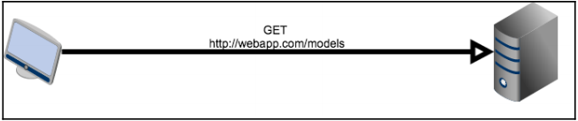
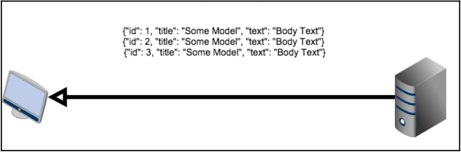
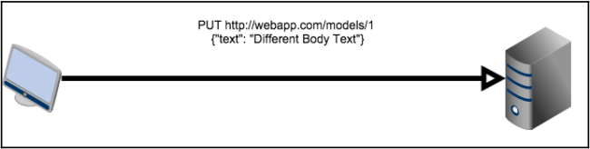

表述性状态传递(REST)是一种用于是实现网络服务的架构风格。由Roy Fielding在2000年在他的博士论文中定义。
REST旨在实现系统间统一与预定义操作的一种标准。这些系统可以说客户端浏览器，移动应用，运行并发worker进程的服务器。
通过使用HTTP方法，REST无关平台，无关编程语言，为了更易于开发，解耦客户端与服务器。
REST通常用于需要在服务器拉取或更新用户信息的网络单页应用(SPAs)。REST也用于向外部开发人员提供通用接口访问用户数据。
比如，Facebook与Twitter都在其应用程序接口中使用REST。

```
Roy Fielding有关REST的原版论文：
https://www.ics.uci.edu/~fielding/pubs/dissertation/rest_arch_style.htm
```

本章我们会学到：
* HTTP协议：请求，响应，方法，头部，以及URI格式
* 如何构建一个REST服务
* 如何使用JWT保护REST服务

-----------------------------------------------

# 什么是REST
在讲REST前，由于它是一种系统间通信的风格，我们先快速看一下它所使用的协议，整本书也是基于此协议完成的。

## HTTP
超文本传输协议（HTTP）是属于第七层的请求-响应协议。本层与应用自身交互。其他属于第七层的协议有：简单邮件传输协议（SMTP），网络文件系统（NFS），以及文件传输协议（FTP）等等。
客户端（用户代理）使用HTTP从服务器请求资源。这些资源可以是HTML文件或其他形式的内容，如JSON，XML，或媒体文件。网络通过是同统一资源定位符（URL）来识别这些对资源的请求。

URL是特定类型的URI，由以下部分组成：
```
<scheme>://<authority>/<path>/<query><fragment>
```

*<authority>* 部分：
```
<userinfo>@<host>:<port>
```

下面是使用我们应用的一个URL示例：
```
http://someserver.com:5000/blog/user/user1?title=sometitle#1
```

我们将元素拆分如下：
Scheme                  HTTP
authority.host          someserver.com
authority.port          5000
path                    blog/user/user1
query                   title=sometitle
fragment                1

接下来我们快速看一下用户代理发往服务器的HTTP请求信息。
这是一个来自Mozilla浏览器的GET请求：
```
GET /blog/user/user1 HTTP/1.1
Host: someserver.com
Accept: image/gif, image/jpeg, */*
Accept-Language: en-us
Accept-Encoding: gzip, deflate
User-Agent: Mozilla/4.0 (compatible; MSIE 6.0; Windows NT 5.1)
Cookie: cookie1=somevalue; cookie2=othervalue;
session:dsofksdfok439349i3sdkfoskfoskfosdkfo
(blank line)
```

HTTP请求组成如下：
* 请求行：由 <Request method> <Request URI> <HTTP version>组成
* 请求头：包含客户端接收的信息，用户代理，cookies，甚至是基础认证凭据
* 空行：分割请求头与请求体
* 请求体：可选

HTTP请求有 GET, HEAD, POST, PUT, DELETE, CONNECT, OPTIONS, TRACE, 和 PATCH。
REST规范会用它们来识别应用类型的操作。

对请求的HTTP响应长这样：
```
HTTP/1.0 200 OK
Content-Type: application/json
Content-Length: 1330
Server: Werkzeug/0.14.1 Python/2.7.10
Date: Thu, 19 Jul 2018 11:14:16 GMT

{ "author": "user1" ... }
```

由如下元素组成：
* 状态行：响应状态
* 响应头：包含有关内容类型，长度，服务器类型（我们的示例中就是开发服务器自身），日期，及其能否发送设置cookie操作的信息。
* 空行
* 响应体：示例中是JSON

状态响应码对REST来说也非常重要。分为如下几类：
* 资讯类：1XX
* 成功：2XX
* 重定向：3XX
* 客户端错误：4XX
* 服务端错误：5XX
  
```
有关状态响应码的详细信息，请看RFC2616：
https://www.w3.org/Protocols/rfc2616/rfc2616-sec10.html
```

# REST定义与最佳实践
在讨论REST的细节前，我们先看一个示例。此实例中，由一个网络浏览器作客户端，还有一个服务器，客户端向服务器发送HTTP请求获取模型信息：



服务器随后会响应一个包含所有模型的文档：



客户端可以通过发送HTTP的PUT请求修改服务器上的数据：



随后，服务器会发回响应，数据就修改好啦。这是一个很简单的示例，但展示了定义REST的方式。

与严格的标准不同，REST制定了一组通信限制，以定义一种可以以多种方式实现的方法。这些限制来自于多年来对其他通信协议的反复试验和错误总结，如远程过程调用（RPC）或简单对象访问协议（SOAP）。
这些协议由于严苛性，复杂性，使用它们创建API较为困难的原因没有REST流行。也正因为发现了这些问题，REST的约束条件可以防止这些问题再次发生。

REST提供了如下指引约束：
* 客户端与服务端分离：只要API不变，客户端与服务端应该可以独立变更。
* 无状态：用于处理请求的信息由客户端存储，或者存储在请求本身之上。
  服务器无状态的一个示例就是Flask中的session对象。session对象并不在服务器上存储信息，而是将信息存储在客户端的cookie中。
  每次请求都会携带这个cookie，用于服务器解析并判断请求中是否有用于请求资源所需的必要数据，而不是让服务器来存储每个用户的会话信息。
* 统一接口：此约束有多个不同的部分：
  * 接口基于资源，也就是我们示例中的模型
  * 由服务器发送的数据并不是服务器中实际的数据，而是它的一种表现形式。比如说，每个请求都会发送JSON抽象数据，而非真实的数据库数据。
  * 由服务器发送的数据足以使客户端修改服务器上的数据。在先前的示例中，ID就作为此部分数据发送给客户端。
  * 每个API所提供的资源必须用同种形式表述，以相同方式访问。比如，不能一个资源用XML表示，另一个用JSON表示。
* 分层的系统：负载均衡器，代理，缓存，以及其他服务器与服务可以充当客户端与服务器间的中间件，即使没有它们，最终结果也是相同的。系统分层提升了性能，扩展性与可用性。
* 缓存能力：客户端可以缓存响应，因此，服务器必须定义响应可否缓存。这么做也可以提升性能。

遵守了这些限制的系统就可以称作是一个RESTful系统。RESTful系统最常见的形式就是由HTTP与JSON构建的。每个字段都定位在它的URL路径上，使用不同的HTTP请求方法来修改资源。
总的来说，有如下几种形式：


# 设置RESTful Flask API
我们会创建一个RESTful接口来访问数据库中的博文数据。数据会以JSON的形式发送。我们会用之前的通用表单获取并修改数据，但URI会是 */api/posts*。
如果我们还未下载本章的示例代码，还未查看Flask URL的API映射，那么可以在应用的根目录看到快捷方式：
```bash
$ # Initialise the virtual environment and database with test data
$ ./init.sh
$ # Activate the python virtual environment
$ source venv/bin/activate
$ export FLASK_APP=main.py
$ echo app.url_map | flask shell | grep api
..
  <Rule '/auth/api' (POST, OPTIONS) -> auth.api>,
  <Rule '/api/post' (HEAD, GET, PUT, POST, OPTIONS, DELETE) -> postapi>,
  <Rule '/api/post/<post_id>' (HEAD, GET, PUT, POST, OPTIONS, DELETE) -> postapi>,
```

我们要实现一个认证API，以及为博文创建CRUD的API。
我们可以使用标准的Flask视图来创建API，但Flask扩展 __Flask Restful__ 使任务更加简单，也会帮我们遵守完整的REST准则。

我们将 Flask-Restful 写入 *requirements.txt* 文件中.

接下来，我们要为API创建一个模块。应用结构如下：
```
./
  main.py
  config.py
  ...
  webapp/
    blog/
    main/
    auth/
    api/
      __init__.py
      blog/
        controlers.py
        fields.py
        parsers.py
    templates/
    static/
```

这一次，对于我们添加的每个应用程序模块——比如博客、共享照片等等——我们在api/模块内部创建一个新模块，在那里定义了所有的API逻辑。还有一种项目结构，就是在每个模块中包含REST API。

就像其他模块一样，在 *api/__init__.py* 中有一个 *create_module* 函数，它为主工厂函数 *create_app* 处理了自己的初始化。
*PostApi* 类也会有用 *Api* 对象的 *add_resource()* 方法所定义的路由。

可以在提供的 *api/\_\_init\_\_.py* 代码文件中看到：
```python
from flask_restful import Api
from .blog.controllers import PostApi

rest_api = Api()
def create_module(app, **kwargs):
  rest_api.add_resource(
    PostApi,
    '/api/post',
    '/api/post/<int:post_id>',
  )
  rest_api.init_app(app)
```

也可以在 *\_\_init\_\_.py* 中看到 *create_app* 函数：
```python
...
def create_app(object_name):
...
  from api import create_module as api_create_module
  ...
  api_create_module(app)

  return app
```

我们 *Post* API的控制逻辑与视图存储在一个名叫 *api/blog* 的新文件夹里的 *controllers.py* 文件中。
在 *controllers.py* 内部，我们要创建API本身：
```python
from flask_restful import Resource


class PostApi(Resource):
  ...
```

在Flask Restful中，每个REST资源定义为类，继承自 *Resource* 对象，任何继承自Resourse对象的类都使用以HTTP方法命名的方法来定义其逻辑。
比如，当 *GET* 这个 HTTP方法触发 *PostApi* 类，就会执行 *get* 方法。

## JWT认证
为了解决我们的认证问题，可以用Flask-Login，它会检查来自登录请求的cookie数据。然而，这需要开发者通过网络接口使用我们的API来登录他们的程序。
我们也有开发者在每次请求都发送它们的登陆数据，但仅当必须要用到敏感信息时再这么做才是良好的设计。
我们的API会提供 *auth/api* 终端来让他们发送登录凭据以获取token。

针对认证机制，我们会使用JSON Web Token（JWT）创建访问token以供客户通过API登录。
JWT令牌断言是哪个用户登录的，从而将服务器保存对数据库的另一个调用进行身份验证。
这个token内部有一个编码的超时日期，逾期则失效。这意味着，即使恶意用户偷到了token，在用户需要重新认证前，这个token只能用一段时间。
要确保使用HTTPS来加密所有和护短-服务端连接。

我们会用另一个Flask扩展--Flask-JWT-extended来使用JWT。

要在 *auth* 模块中进行扩展的初始化。*auth/\_\_init\_\_.py*：
```python
from flask_jwt_extended import JWTManager
···
jwt = JWTManager()
...


def create_module(app, **kwargs):
  ...
  jwt.init_app(app)
  ...
```

接下来，我们用如下helper函数来认证用户：
```python
def authenticate(username, password):
  from .models import User
  user = User.query.filter_by(username=username).first()
  if not user:
    return None
  # Do the passwords match
  if not user.check_password(password):
    return None
  return user
```

登录终端本身的定义可以在 *auth/controllers.py* 文件中找到：
```python
@auth_blueprint.route('/api', methods=['POST'])
def api():
  if not request.is_json:
    return jsonify({"msg": "Missing JSON in request"}), 400

  username = request.json.get('username', None)
  password = request.json.get('password', None)
  if not username:
    return jsonify({"msg": "Missing username parameter"}), 400
  if not password:
    return jsonify({"msg": "Missing password parameter"}), 400
  user = authenticate(username, password)
  if not user:
    return jsonify({"msg": "Bad username or password"}), 401
  # Identity can be any data that is json serializable
  access_token = create_access_token(identity=user.id)
  return jsonify(access_token=access_token), 200
```

首先，我们会校验，请求中是否有JSON体。我们使用Flask的 *request.is_json* 函数。
接下来，我们使用 *request.json.get* 从JSON体种抽出用户名与密码。而后，我们使用之前的 *authenticate* 函数检查用户凭证。
最后，我们用用户id返回了JWT访问token。

我们的API用户将必须将从该资源接收到的令牌传递给任何需要用户凭据的方法。
为了测试这段代码，会用到名叫 __curl__ 的这个工具。
Curl是一个Bash带的命令行工具，可以创建并操作HTTP请求。
为了测试，使用 *curl* 工具先进行登入：
```bash
$ curl -H "Content-Type: application/json" -d
'{"username":"user1","password":"password"}' http://localhost:5000/auth/api
{
 "access_token":
"eyJhbGciOiJIUzI1NiIsInR5cCI6IkpXVCJ9.eyJqdGkiOiIyOGZjMDNkOC0xY2MyLTQwZDQtO
DJlMS0xMGQ0Mjc2YTk1ZjciLCJleHAiOjE1MzIwMTg4NDMsImZyZXNoIjpmYWxzZSwiaWF0Ijox
NTMyMDE3OTQzLCJ0eXBlIjoiYWNjZXNzIiwibmJmIjoxNTMyMDE3OTQzLCJpZGVudGl0eSI6InV
zZXIxIn0.Cs-ANWq0I2M2XMrZpQof-_cX0gsKE7U4UG1t1rB0UoY"
}
```

我们之后使用 *-H* 发送请求头，声明请求体为JSON，用 *-d* 发送请求体数据。接下来，我们可以用token访问API保护的资源：
```bash
$ export
ACCESS="eyJhbGciOiJIUzI1NiIsInR5cCI6IkpXVCJ9.eyJqdGkiOiIyOGZjMDNkOC0xY2MyLT
QwZDQtODJlMS0xMGQ0Mjc2YTk1ZjciLCJleHAiOjE1MzIwMTg4NDMsImZyZXNoIjpmYWxzZSwia
WF0IjoxNTMyMDE3OTQzLCJ0eXBlIjoiYWNjZXNzIiwibmJmIjoxNTMyMDE3OTQzLCJpZGVudGl0
eSI6InVzZXIxIn0.Cs-ANWq0I2M2XMrZpQof-_cX0gsKE7U4UG1t1rB0UoY"
$ curl -H "Authorization: Bearer $ACCESS" http://localhost:5000/api/post
```

注意访问令牌在请求头用户授权上发送的方式。如果我们尝试不用token访问相同资源的话：
```bash
$ curl -v http://localhost:5000/api/post
...
< HTTP/1.0 401 UNAUTHORIZED
...
{
 "msg": "Missing Authorization Header"
}
```

如我们所想，我们得到了HTTP 401 状态码。为了保护API终端，我们得使用 *flask-jwt-extended* 的装饰器 *@jwt_required*，并用其拉取用户名，我们使用 *get_jwt_identity()* 函数。
```
*flask-jwt-extended* 装饰器提供了一些额外的功能，如token过期，刷新token终端与一些配置项的能力。详细可以参考：
http://flask-jwt-extended.readthedocs.io/en/latest/
```

# Get请求
对于有些  GET, PUT, 和 DELETE 请求，我们的API需要博文ID用于请求的操作。

要发给客户端的数据必须得是JSON表示的 *Post* 对象，因此我们的 *Post* 对象是怎么转换的呢？
Flask Restful提供了一种通过 *fields* 对象与 *marshal_with* 函数装饰器将任意对象转换成JSON的方式。

## 输出格式化
通过创建表示基本类型的 *field* 对象字典定义输出格式。
字段的键定义了字段属性会尝试进行转换的类型。通过将字典传递到 *marshal_with* 装饰器，所有 *get* 方法尝试返回的对象会先用字典进行转换。这对对象列表同样奏效。
让我们看一个实现此API终端的简单方式。下述示例代码会考虑到分页，但我们会在之后展示分页的处理。

*api/blog/controllers.py* 文件：
```python
import datetime
from flask import abort
from flask_restful import Resource, fields, marshal_with
from flask_jwt_extended import jwt_required, get_jwt_identity
from webapp.blog.models import db, Post, Tag
from webapp.auth.models import User
...

post_fields = {
  'id': fields.Integer(),
  'author': fields.String(attribute=lambda x: x.user.username),
  'title': fields.String(),
  'text': HTMLField(),
  'tags': fields.List(fields.Nested(nested_tag_fields)),
  'publish_date': fields.DateTime(dt_format='iso8601') 
}


class PostApi(Resource):
  @marshal_with(post_fields)
  @jwt_required
  def get(self, post_id=None):
    if post_id:
      post = Post.query.get(post_id)
      if not post:
        abort(404)
      return post
    else:
      posts = Post.query.all()
      return posts
```

当在浏览器中重载API时，每个 *Post* 对象都会以JSON的形式呈现。
要留意字段声明的 *HTMLField*。问题在于API不应该从博文创建表单的WYSIWYG编辑器种返回HTML。
如前所述，服务器不应该关注UI，而HTML纯粹用于输出规范。
为了解决这个问题，我们需要一个自定义的字段对象，它会将字符串拆解成HTML。
*api/blog/* 文件夹中名为 *fields.py* 的新文件种，我们写了如下代码：
```python
try:
  # Try python3
  from html.parser import HTMLParser
except Exception as e:
  # Nop python2
  from HTMLParser import HTMLParser

from flask_restful import fields


class HTMLStripper(HTMLParser):
  fed = list()

  def __init__(self):
    self.reset()
    self.fed = []

  def handle_data(self, d):
    self.fed.append(d)

  def get_data(self):
    return ''.join(self.fed)

def strip_tags(html):
  s = HTMLStripper()
  s.feed(html)
  return s.get_data()


class HTMLField(fields.Raw):
  def format(self, value):
    return strip_tags(str(value))
```

考虑到Python2与Python3的兼容性，我们使用了异常处理块儿，因为Python3标准库中的 *HTMLParser* 发生了变化。
*strip_tags* 函数会返回经过清理后的HTML标签字符串。通过继承 *fields.Raw* 类定义叫做 *HTMLfield* 的新的字段类型并通过 *strip_tags* 函数发送数值。
如果页面重载，所有的HTML都消失不再，只有文本会保留下来。

Flask Restful 提供了一些默认字段：
* fields.String: 使用str()进行值转换
* fields.FormattedString: 这将在Python中传递带有括号内变量名的格式化字符串
* fields.Url: 提供的功能与Flask的 *url_for* 函数一样
* fields.DateTime: 将Python *date* 或 *datetime* 对象转换为字符串。*format* 关键字参数指定字符串是ISO8601日期还是RFC822日期
* fields.Float: 将值转换为浮点数的字符串表示
* fields.Integer: 将值转换为整数的字符串表示
* fields.Nested: 使得内嵌对象可以通过字段对象的字典进行表示
* fields.List: 更像是MongoEngine API，此字段接收另一个字段类型作参数，尝试将列表值转换为字段类型的JSON列表
* fields.Boolean: 将值转换为布尔值的字符串表示

这允许表示对象的任何属性，而不仅仅是基本级别的属性。
因为tags的多对多关系返回了对象列表，相同的解决方案不适用tags。
可以使用 *ListField* 中的 *NestedField* 类型和另一个字段字典返回一个tag字典。这样做还有一个额外的好处是，它为API的最终用户提供了一个标签ID，以便他们可以像有标签API一样轻松地进行查询。

## 请求参数
当向基础数据资源发送GET请求时，我们的API现在会发送所有数据库中的Post对象。
如果数据量较小，或者使用此API的人数不多时，咋都行。但凡数据量增大或使用API的人数增多，API会给数据库带来较大的压力。向网络接口一样，API也应该做分页操作。

我们的API会需要接收一个名为 *page* 的GET查询字符串参数，它指定了要加载哪一页。
Flask-Restful提供了一个抓取请求并对其进行解析的方法。如果没有所需参数，或是参数类型不匹配，Flask Restful会自动创建一个JSON错误消息。
在 *api/blog/* 文件夹中的 *parsers.py* 文件中：
```python
...
from flask_restful import reqparse
...
post_get_parser = reqparse.RequestParser()
post_get_parser.add_argument(
  'page',
  type=int,
  location=['args', 'headers'],
  required=False,
)
```

当请求没有博文ID时，我们应该在 *PostApi* 加上如下代码：
```python
from .parsers import post_get_parser
...
class PostApi(Resource):
  @marshal_with(post_fields)
  @jwt_required
  def get(self, post_id=None):
    if post_id:
       ..
      return post
    else:
      args = post_get_parser.parse_args()
      page = args['page'] or 1
      ...
      posts = Post.query.order_by(
        Post.publish_date.desc()
      ).paginate(page, current_app.config.get('POSTS_PER_PAGE', 10))
      ...
      return posts.items
```

在之前的示例中，*RequestParser* 在查询字符串或请求头中查找变量 *page*，并从对应页返回带有 *Post* 对象的页对象。
这次我们想网络视图页版本一样来使页面可配置。我们使用 *current_app* Flask代理来获取配置中的配置值。

在使用 *RequestParser* 创建了parser对象后，可以使用 *add_argument* 方法来增加参数。
*add_argument* 的第一个参数是要解析的参数键，但 *add_argument* 也接收很多关键字参数：
* action: 在成功解析后，parser对值做的操作。有两个可选项，*store* 和 *append*。
  *store* 将解析到的值添加到返回的字典中。
  *append* 将解析到的值追加至字典中某列表的末尾。
* case_sensitive: 此参数为布尔类型，决定键是否大小写敏感。
* choices: 有点像MongoEngine，是可用的参数列表。
* default: 如果请求中没有参数的话会用此值。
* dest: 这是在返回的数据中添加解析后的值的关键字。
* help: 如果校验失败，向用户返回的消息。
* ignore: 布尔值，是否允许类型转换失败。
* location: 指定去哪里查找数据：
  * GET查询字符串中的 *args*
  * HTTP请求头中的 *headers*
  * HTTP POST数据中的 *form*
  * HTTP cookies中的 *cookies*
  * 所有发送的JSON
  * POST文件数据中的文件
* required: 布尔值，决定参数是否可选。
* store_missing: 布尔值，如果请求中没有参数时，要不要存储默认值。
* type: 所传递值要转换的Python类型

使用Flask Restful parser来向API添加新参数非常容易。
比如，我们添加一个user参数，让我们查找此用户所做的所有博文。
首先，在 *api/blog/parsers.py* 文件中：
```python
post_get_parser = reqparse.RequestParser()
post_get_parser.add_argument('page', type=int, location=['args', 'headers'])
post_get_parser.add_argument('user', type=str, location=['args', 'headers'])
```

而后，在 *api/blog/controllers.py* 文件中：
```python
class PostApi(Resource):
  @marshal_with(post_fields)
  @jwt_required
  def get(self, post_id=None):
    if post_id:
      ...
      return post
    else:
      args = post_get_parser.parse_args()
      page = args['page'] or 1
      if args['user']:
        user = User.query.filter_by(username=args['user']).first()
        if not user:
          abort(404)
        posts = user.posts.order_by(
          Post.publish_date.desc()
        ).paginate(page, current_app.config.get('POSTS_PER_PAGE', 10))
      else:
        posts = Post.query.order_by(
          Post.publish_date.desc()
        ).paginate(page, current_app.config.get('POSTS_PER_PAGE', 10))
      return posts.items
```

当从 *Resource* 调用Flask的 *abort* 函数时，Flask Restful会自动地创建一个有状态码的错误消息用作返回值。

为了测试API，出于简便性，我们使用 *curl*，其实用啥与HTTP APIs交互的工具都行。在从我们的认证终端请求到访问令牌后，请求id=1的博文：
```bash
$ curl -H "Authorization: Bearer $ACCESS"
"http://localhost:5000/api/post/1"
```
或者我们可以这么请求所有的博文：
```bash
$ curl -H "Authorization: Bearer $ACCESS" "http://localhost:5000/api/post"
```
请注意，按照预期响应只获取第一页，现在我们来请求第二页：
```bash
$ curl -H "Authorization: Bearer $ACCESS"
"http://localhost:5000/api/post?page=2"
```
最终，我们可以请求来自特定用户的博文：
```bash
$ curl -H "Authorization: Bearer $ACCESS"
"http://localhost:5000/api/post?user=user1"
```

# Post请求
REST之上的 *POST* 方法用于资源的创建，它并非是幂等的方法。通过使用Flask Restful parser，我们可以处理 *POST* 终端。
首先，我们需要一个接收标题，体文本，标签列表的解析器。在 *parser.py* 中：
```python
post_post_parser = reqparse.RequestParser()
post_post_parser.add_argument(
  'title',
  type=str,
  required=True,
  help="Title is required",
  location=('json', 'values')
 )
post_post_parser.add_argument(
  'text',
  type=str,
  required=True,
  help="Body text is required",
  location=('json', 'values') 
)
post_post_parser.add_argument(
  'tags',
  type=str,
  action='append',
  location=('json', 'values') 
)
```

接下来，我们已经创建了叫做 *add_tags_to_post* 的辅助函数，来讲标签添加至博文。
如果标签不存在，会向数据库中创建此标签。我们会在 *POST* 与 *PUT* 请求中用到它们。
这里没什么新东西，只是一个简单的SQLAlchemy辅助函数，用于帮助我们保持代码简洁。

然后，*PostApi* 类会需要一个 *post* 方法来处理到来的请求。
*post* 方法会使用给定的标题，体文本值。并且如果 *tags* 键存在，就把标签加到博文上，如果不存在就创建新标签：
```python
import datetime
from .parsers import (
  post_get_parser,
  post_post_parser
)
from webapp.models import db, User, Post, Tag


class PostApi(Resource):
  ...
  @jwt_required
  def post(self, post_id=None):
    args = post_post_parser.parse_args(strict=True)
    new_post = Post(args['title'])
    new_post.user_id = get_jwt_identity()
    new_post.text = args['text']
    if args['tags']:
      add_tags_to_post(post, args['tags'])
    db.session.add(new_post)
    db.session.commit()
    return {'id': new_post.id}, 201
```

在 *return* 声明处，如果返回了一个元组，第二个参数会认作为状态码。
可以通过传递一个字典表示额外的头部值作为第三个参数。
我们用 *get_jwt_identity* 从JWT令牌获取用户ID，因为我们在登录时使用用户ID来设置的JWT身份。
要传递 *POST* 变量，会使用 *d* 选项：
```bash
$ curl -X POST -H "Authorization: Bearer $ACCESS" -H "Content-Type:
application/json" -d '{"title":"Text Title", "text":"Some text"}'
"http://localhost:5000/api/post"
{
 "id": 310
}
```

应该返回新建博文的ID。我们可以通过浏览器看到新建的博文，作者是认证令牌中所用的用户。

# Put请求
如在本章开始的表格中所陈列的那样，*PUT* 请求用于更改既存资源的值。和 *post* 方法一样，我们首先要做的就是在 *parsers.py* 中创建一个新的解析器：
```python
post_put_parser = reqparse.RequestParser()
post_put_parser.add_argument(
  'title',
  type=str,
  location=('json', 'values') 
)
post_put_parser.add_argument(
  'text',
  type=str,
  location=('json', 'values') 
)
post_put_parser.add_argument(
  'tags',
  type=str,
  action='append',
  location=('json', 'values') 
)
```

*put* 方法的逻辑与 *post* 方法非常相似。主要的区别在于每个变更都是可选的，并会拒绝没有提供 *post_id* 的请求：
```python
...
def add_tags_to_post(post, tags_list):
  for item in tags_list:
    tag = Tag.query.filter_by(title=item).first()
    # Add the tag if it exists. If not, make a new tag
    if tag:
      post.tags.append(tag)
    else:
      new_tag = Tag(item)
      post.tags.append(new_tag)
...

@jwt_required
def put(self, post_id=None):
  if not post_id:
    abort(400)
  post = Post.query.get(post_id)
  if not post:
    abort(404)
  args = post_put_parser.parse_args(strict=True)
  if get_jwt_identity() != post.user_id:
    abort(403)
  if args['title']:
    post.title = args['title']
  if args['text']:
    post.text = args['text']
  if args['tags']:
    print("Tags %s" % args['tags'])
    add_tags_to_post(post, args['tags'])

  db.session.merge(post)
  db.session.commit()
  return {'id': post.id}, 201
```

就像我们对网络视图所做的处理一样，我们拒绝了非作者对博文的修改请求。
为了测试这个方法，*curl* 也能用 *-x* 创建 *PUT* 请求：
```bash
$ curl -X PUT -H "Authorization: Bearer $ACCESS" -H "Content-Type:
application/json" \
 -d '{"title": "Modified From REST", "text": "this is from REST",
"tags": ["tag1","tag2"]}' \
http://localhost:5000/api/post/5
```

# Delete请求
最终，*DELETE* 请求是四个所支持的方法中最简单的一个。主要的区别是它并不返回内容，这也是 *DELETE* 请求的公认标准：
```python
@jwt_required
def delete(self, post_id=None):
  if post_id:
    abort(400)
  post = Post.query.get(post_id)
  if not post:
    abort(404)
  if get_jwt_identity() != post.user_id:
    abort(401)
  db.session.delete(post)
  db.session.commit()
  return "", 204
```

我们使用下述命令进行测试：
```bash
$ curl -X DELETE -H "Authorization: Bearer $ACCESS"
http://localhost:5000/api/post/102
```

如果删除成功，我们会收到 *204* 状态码，并且没有什么展示的信息。

在我们结束REST的学习前，有一个终极挑战可以检测我们对Flask Restful的理解。
尝试创建一个评论API，不但可以通过 * http://localhost:5000/api/comments* 做修改，而且可以让开发者通过使用URL *http://localhost:5000/api/post/<int:post_id>/comments* 修改某特定博文上的评论。

# 总结
我们的 *Post* API功能开发完毕了。开发者可以使用这个API来创建一个桌面或移动应用，所有的一切都不用HTML爬取，这么做漫长且乏味。
赋予开发者将我们的网站作为平台的能力会是我们的网站更受欢迎，因为本质上是他们会用他们的网站或应用给我们免费打广告。

下章，我们会使用流行的 *Celery* 项目来让我们的应用异步地运行程序和任务。
