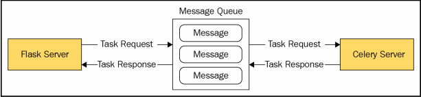
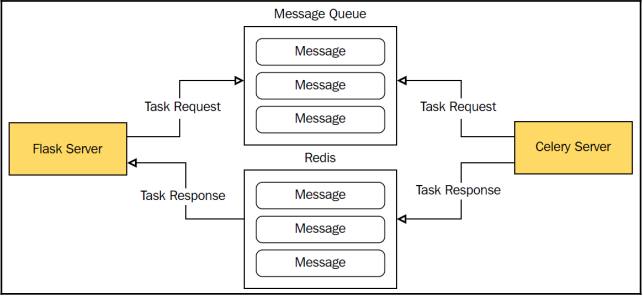

对于创建网络应用来说，让处理请求的时间保持在50毫秒以内非常重要。
在每秒有中到高请求率的web应用程序或web服务上，响应时间变得更加重要。
将请求比作液体，对其处理速度至少要像它的流速一样块，不然就会溢出来。
可以避免一些在服务器上的额外操作处理，也应该这么做。
然而，在一个web应用程序中，需要超过几秒钟的操作需求是很常见的，特别是当涉及到复杂的数据库操作或图像处理时。

在构建一个可水平扩展的应用中，应该要将笨重的处理过程与网络服务器层进行解耦，将它们放到可以独立扩展的worker层。

为了保护用户体验与网站的可靠性，可以使用名为Celery的任务队列将这些操作移出Flask外。

本章，我们会涉及如下话题：
* 使用Docker运行RabbitMQ与Redis
* Celery与Flask的集成
* 学习识别需要在网络服务器之外运行的任务
* 创建并调用从简单异步到复杂工作流的几种任务
* 将Celery用作有心跳功能的调度器

---------------------------------------

# 什么是Celery
Celery是Python写的一个异步任务队列。它使用Python的多进程库，并发运行多个用户定义的任务。
Celery接收消息，告诉它从代理启动一个任务，这个代理通常叫做消息队列，如下图所示：



__消息队列__ 是一个专门用来在生产者与消费者间发送数据的系统。
__生产者进程__  是创建要发送到队列的消息的程序，__消费者进程__ 是从队列中获取消息的程序。
从生产者发送的消息存储在先进先出（FIFO）的队列中，会最先获取到最旧的消息。
消息会一直存储在队列中，知道消费者接收消息，随后就会删除此消息。
消息队列不依赖轮询，提供了实时的消息机制，也就是我们不用一直检查进程状态。
当生产者发送消息时，消费者监听它们与消息队列的连接，获取新的消息；消费者并非一直与队列通信。
这种差别就好像是AJAX与WebSockets的区别，AJAX需要一直与服务器保持连接，而WebSockets只是一个连续的双向通信流。

我们也可以用传统的数据库代替消息队列。Celery甚至还内置了对SQLAlchemy的支持。可是并不建议将数据库用作Celery的代理。
使用数据库而非消息队列需要消费者一直轮询数据库。并且，由于Celery的并发是通过多进程实现的，大量的连接数会产生很多的读取操作。
在中等的负载下，使用数据库做代理需要生产者有很多的写的操作，与此同时，消费者也一直在读取数据。

可以用消息队列作为代理，数据库来存储任务结果。
在之前的图片中，消息队列用于发送任务请求与任务结果。可用数据库存储任务结果可以无限存储最终产物，而消息队列会在生产者收到数据时马上抛出数据，如图所示：



这里的数据库通常是一个键/值NoSQL来处理负载。如果我们计划对之前运行的任务做分析的话，用NoSQL非常有用，不然的话使用消息队列会更安全些。

甚至还可以完全丢弃任务结果，或者根本就不返回结果。这样做的一个缺点是，生产者不知道任务成没成功，但通常，可以在较小的项目中这么用。

我们会使用RabbitMQ作Celery的消息代理。RabbitMQ可以运行在所有的主流操作系统上，设置简单，运行方便。
Celery不同其他额外的库就可以支持RabbitMQ，它也是Celery文档所推荐的消息队列。

```
我们也可以用Redis作为消息代理。二者间的唯一区别就是连接字符串不同。详细信息请看：
http://docs.celeryproject.org/en/latest/getting-started/brokers/redis.html
```

# 设置Celery与RabbitMQ
要在我们的虚拟环境中安装Celery，我们得把它加到 *requirements.txt* 文件中。
和往常一样，使用提供的 *init.sh* 脚本，或使用此处介绍的流程来创建并安装所有Python虚拟环境的依赖。

我们还需要装一个Flask扩展来帮我们处理Celery的初始化：
```bash
$ pip install Flask-Celery-Helper
```

Flask文档说可以不用Flask的Celery扩展。然而，当我们的应用程序与一个应用程序工厂一起组织起来时，让Celery服务器使用Flask的应用程序上下文是非常重要的。因此我们用 * Flask-Celery-Helper* 把这个累活儿干了。

为了轻松地启动并运行RabbitMQ，我们将使用一个Docker容器。要确保我们安装并设置好了Docker；如果还没的话，可以参考第一章。首先我们需要一个简单的Dockerfile：
```
FROM rabbitmq:3-management
ENV RABBITMQ_ERLANG_COOKIE "SWQOKODSQALRPCLNMEQG"
ENV RABBITMQ_DEFAULT_USER "rabbitmq"
ENV RABBITMQ_DEFAULT_PASS "rabbitmq"
ENV RABBITMQ_DEFAULT_VHOST "/"
```

